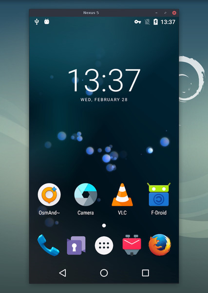

# (v4.0)


_pronounced "**scr**een **c**o**py**"_

This application mirrors Android devices (video and audio) connected via USB or
[TCP/IP](doc/connection.md#tcpip-wireless) and allows control using the
computer's keyboard and mouse. It does not require _root_ access or an app
installed on the device. It works on _Linux_, _Windows_, and _macOS_.

[](doc/linux.md)&nbsp;
[](doc/windows.md)&nbsp;
[](doc/macos.md)&nbsp;



It focuses on:

 - **lightness**: native, displays only the device screen
 - **performance**: 30~120fps, depending on the device
 - **quality**: 1920×1080 or above
 - **low startup time**: ~1 second to display the first image
 - **non-intrusiveness**: nothing is left installed on the Android device
 - **user benefits**: no account, no ads, no internet required
 - **freedom**: free and open source software

Its features include:
 - [audio forwarding](doc/audio.md) (Android 11+)
 - [recording](doc/recording.md)
 - [virtual display](doc/virtual-display.md)
 - mirroring with [Android device screen off](doc/device.md#turn-screen-off)
 - [copy-paste](doc/control.md#copy-paste) in both directions
 - [configurable quality](doc/video.md)
 - [camera mirroring](doc/camera.md) (Android 12+)
 - [mirroring as a webcam (V4L2)](doc/v4l2.md) (Linux-only)
 - physical [keyboard][hid-keyboard] and [mouse][hid-mouse] simulation (HID)
 - [gamepad](doc/gamepad.md) support
 - [OTG mode](doc/otg.md)
 - and more…

[hid-keyboard]: doc/keyboard.md#physical-keyboard-simulation
[hid-mouse]: doc/mouse.md#physical-mouse-simulation

## Prerequisites

The Android device requires at least API 21 (Android 5.0).

[Audio forwarding](doc/audio.md) is supported for API >= 30 (Android 11+).

Make sure you [enabled USB debugging][enable-adb] on your device(s).

[enable-adb]: https://developer.android.com/studio/debug/dev-options#enable

On some devices (especially Xiaomi), you might get the following error:

```
Injecting input events requires the caller (or the source of the instrumentation, if any) to have the INJECT_EVENTS permission.
```

In that case, you need to enable [an additional option][control] `USB debugging
(Security Settings)` (this is an item different from `USB debugging`) to control
it using a keyboard and mouse. Rebooting the device is necessary once this
option is set.

Note that USB debugging is not required to run scrcpy in [OTG mode](doc/otg.md).


## Get the app

 - [Linux](doc/linux.md)
 - [Windows](doc/windows.md) (read [how to run](doc/windows.md#run))
 - [macOS](doc/macos.md)


## Must-know tips

 - [Reducing resolution](doc/video.md#size) may greatly improve performance
   (`scrcpy -m1024`)
 - [_Right-click_](doc/mouse.md#mouse-bindings) triggers `BACK`
 - [_Middle-click_](doc/mouse.md#mouse-bindings) triggers `HOME`
 - <kbd>Alt</kbd>+<kbd>f</kbd> toggles [fullscreen](doc/window.md#fullscreen)
 - There are many other [shortcuts](doc/shortcuts.md)


## Usage examples

There are a lot of options, [documented](#user-documentation) in separate pages.
Here are just some common examples.

 - Capture the screen in H.265 (better quality), limit the size to 1920, limit
   the frame rate to 60fps, disable audio, and control the device by simulating
   a physical keyboard:

    ```bash
    scrcpy --video-codec=h265 --max-size=1920 --max-fps=60 --no-audio --keyboard=uhid
    scrcpy --video-codec=h265 -m1920 --max-fps=60 --no-audio -K  # short version
    ```

 - Start VLC in a new virtual display (separate from the device display):

    ```bash
    scrcpy --new-display=1920x1080 --start-app=org.videolan.vlc
    ```

 - Start VLC in a new _flex_ display using H.265 with a bitrate of 16 Mbps,
   while keeping the display active so it does not turn off:

    ```bash
    scrcpy --new-display -x --keep-active --start-app=org.videolan.vlc --video-codec=h265 -b16M
    ```

 - Record the device camera in H.265 at 1920x1080 (and microphone) to an MP4
   file:

    ```bash
    scrcpy --video-source=camera --video-codec=h265 --camera-size=1920x1080 --record=file.mp4
    ```

 - Capture the device front camera and expose it as a webcam on the computer (on
   Linux):

    ```bash
    scrcpy --video-source=camera --camera-size=1920x1080 --camera-facing=front --v4l2-sink=/dev/video2 --no-playback
    ```

 - Control the device without mirroring by simulating a physical keyboard and
   mouse (USB debugging not required):

    ```bash
    scrcpy --otg
    ```

 - Control the device using gamepads plugged into the computer:

    ```bash
    scrcpy --gamepad=uhid
    scrcpy -G  # short version
    ```

## User documentation

The application provides a lot of features and configuration options. They are
documented in the following pages:

 - [Connection](doc/connection.md)
 - [Video](doc/video.md)
 - [Audio](doc/audio.md)
 - [Control](doc/control.md)
 - [Keyboard](doc/keyboard.md)
 - [Mouse](doc/mouse.md)
 - [Gamepad](doc/gamepad.md)
 - [Device](doc/device.md)
 - [Window](doc/window.md)
 - [Recording](doc/recording.md)
 - [Virtual display](doc/virtual-display.md)
 - [Tunnels](doc/tunnels.md)
 - [OTG](doc/otg.md)
 - [Camera](doc/camera.md)
 - [Video4Linux](doc/v4l2.md)
 - [Shortcuts](doc/shortcuts.md)
